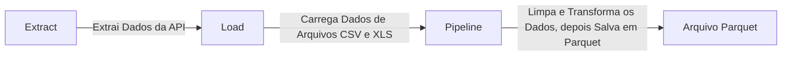

# Projeto de ETL de Commodities

Este projeto tem como objetivo criar um arquivo parquet após a junção de três bases distintas e a realização de 
cálculos de KPI's e Upsert dos dados:

[Arquivo Parquet final](data)

1. **Parte de Extract**: Responsável por extrair dados de uma API do BC e carregar em memória.
2. **Parte de Load**: Carrega dados de movimentações de commodities a partir de arquivos CSVe XLS.
3. **Parte de pipeline**: Processa as funções de extração/ carga de dados, transforma os dados e salva um arquivo parquet.

### Ideia de ETL

    
